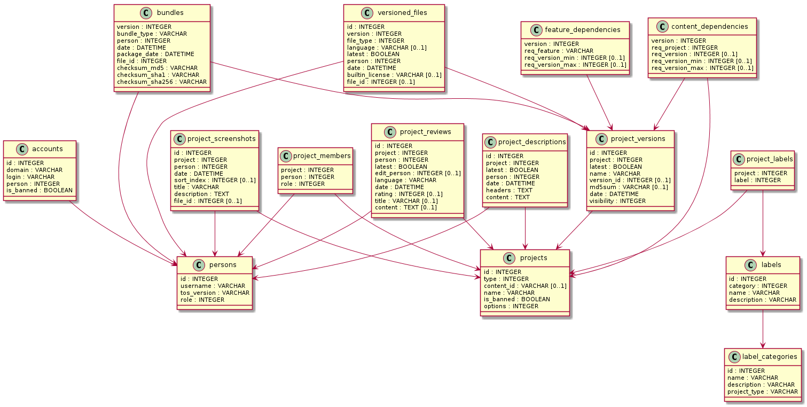

# Introduction

This document describes what data is stored by bananas2, and who can access, add, modify or delete it.

## The Bananas Promise

Bananas is build around a simple promise:
> *Content that has been available for download once, remains available for savegames that use it, forever.*

This means that when new versions of content is uploaded, or content resolves into other projects, the old content
can be hidden/made unavailable for new players.
But when a player has a savegame or scenario which requires a specific version of some content, they can get it.

This implies that you cannot truely delete content from Bananas without breaking the Bananas Promise, you can only
hide content.

True deleting of content and breaking the promise is only possible when the author leaves Bananas. However this
implies the author getting banned for live time.
In other words:

* As content author can join Bananas and respect the Bananas promise.
* As content author you can break the Bananas promise and leave forever.
* You can join and leave Bananas only once.

## User roles

Users registered to Bananas can have global roles, and project-specific roles.

Global roles:

* Administrator: People who maintain Bananas. They can do everything that is technically viable, so you have to trust them :)
* Moderator: People who moderate the social interaction on Bananas.
* Curators: People who assist projects owners with sorting/categorising content to make navigating Bananas a pleasant experience.
* Regular users: When you join Bananas, you get this role.
* Banned user: You get this role, when you leave Bananas.
* Anonymous: This role is for the anonymous user, someone who did not login.

Project-specific roles:

* Project owners: These people can do almost everything with their project. The only rule is the Bananas Promise.
* Project editors: These people can do everything what a project owner can do, except assigning/removing project owners/editors.

# User accounts

People can register to Bananas, if they want to do anything beyond what the anonymous user can do.

Bananas distinguishes "Persons" and "Accounts".

* Persons are individual human/non-human beings.
* Accounts are login credentials, which allow to identify as a specific Person.

To enable easier access to Bananas, it supports multiple authentication servers.
People can login with their OpenTTD account, but also with GitHub, and possibly with TT-Forums.
For this purpose multiple Accounts can be connected to the same Person.

However, there are no group accounts. A Person is always a single person.
Projects may be owned by multiple Persons, but Persons and Accounts are not shared by different people.

This data is stored for Persons and their Accounts:

| Column             | Description                                   | Annoymous/Users/Curators | User themself | Moderators | Administrators | Permanent delete            |
| ------------------ | --------------------------------------------- | ------------------------ | ------------- | ---------- | -------------- | --------------------------- |
| Person.username    | Visible nick name when referencing a Person.  | Read                     | Update        | Read       | Update         | Replaced with "Banned user" |
| Person.tos_version | Version of Bananas Terms-Of-Service accepted. | Invisible                | Update        | Invisible  | Read           | No, invisible only          |
| Person.role        | Global role, including "Banned user".         | Invisible                | Read          | Update (1) | Update         | No                          |
| Account.domain     | Authentication server.                        | Invisible                | Create        | Invisible  | Read           | No                          |
| Account.login      | Login name                                    | Invisible                | Create        | Invisible  | Read           | No                          |
| Account.is_banned  | Whether the account is still valid.           | Invisible                | Update        | Invisible  | Update         | No                          |

(1) Moderators can assign Curators and ban regular users. Project owners can only be banned by Administrators, since this implies banning their content.

The listed data about Persons and Accounts is stored forever for the purpose of effectively banning people and accounts.
After leaving Bananas none of the data is visible to regular users, but people can discover the banned users by trying to register with the same name.

# Projects

When users have accepted the Bananas Terms-Of-Service, specifically the Bananas Promise, they can create new projects, or they can be invited to existing projects.

Bananas allows these types of projects:

| Project type                            | Bananas Promise | License options | Unique ID |
| --------------------------------------- | --------------- | --------------- | --------- |
| Base Graphics/Sounds/Music              | weak            | any             | Shortname |
| NewGRF                                  | strong          | any             | GRF ID    |
| AI and Game Scripts and Libraries       | strong          | any             | Shortname |
| Heightmaps and Scenarios                | weak            | any             | none      |
| NewGRF Presets                          | no              | [CC0](https://creativecommons.org/share-your-work/public-domain/cc0) only | none |
| OpenTTD Releases, Forks and Patchpacks  | weak            | [GPLv2](https://www.gnu.org/licenses/gpl-2.0.html) only | none |

* NewGRFs and Scripts are dependencies of savegames/scenarios, so the Bananas Promise fully applies.
* Base sets and heightmaps/scenarios are no dependencies of savegames, but for simplicity the Bananas Promise still applies.
* OpenTTD binaries can be dependencies of savegames/scenarios, so the Bananas Promise kind of applies. However, to limit storage demand, only tags/releases of forks are stored forever. Pre-releases/nightly builds may be removed if necessary.
* NewGRF presets have simplified policies. The Bananas Promise does not apply, and they may only use the [CC0](https://creativecommons.org/share-your-work/public-domain/cc0) license.

Projects are identified by their type and a unique ID (see above) and/or name.

* For projects types with unique IDs, the unique ID is the true identificator, while the name can be changed.
* Not all projects types have unique IDs. Their name is still changeable, but following them will be harder. For client communication Bananas assigns an arbitrary unique ID.

Other information can be changed.

| Column               | Description                                                 | Annoymous/Users/Curators/Moderators | Project editors | Project owners | Administrators | Permanent delete   |
| -------------------- | ----------------------------------------------------------- | ----------------------------------- | --------------- | -------------- | -------------- | ------------------ |
| Project.type         | Project type                                                | Read (1)                            | Read            | Create         | Read           | No, invisible only |
| Project.content_id   | Unique ID for projects with unique IDs                      | Read (1)                            | Read            | Create         | Read           | No, invisible only |
| Project.name         | Project name (single language, not translated)              | Read (1)                            | Update          | Update         | Update         | No, invisible only |
| Project.is_banned    | Whether the project was banned from Bananas                 | Read (1)                            | Read            | Read           | Update         | No                 |
| Project.options      | Project settings, permissions of regular users and curators | (invisible)                         | Update          | Update         | Update         | No                 |
| ProjectMember.person | Members of a project                                        | Read (1)                            | Read            | Create, Delete | Create,Delete  | No, invisible only |
| ProjectMember.role   | Roles of members: Editor, Owner                             | Read (1)                            | Read            | Update         | Update         | No, invisible only |

(1) Projects which left Bananas will be displayed as "Banned project" to regular users/curators/moderators, and former members will be invisible.

The listed data about Projects is stored forever for the purpose of effectively banning projects.
After leaving Bananas none of the data is visible to regular users, but people can discover the banned projects by trying the unique IDs and names.

# Project description

All projects have a public description, which describes the content.
A description consists of two parts:

* A tabular header listing various single line attributes, like URLs or keywords.
* A longer description as markdown text.

There is only one description for a project, which applies to all versions of the content.
The description is by default editable by project owner and editors. But they can also grant edit access to global curators.
To ease the shared editing the complete history of all description editions is visible to everyone with edit permissions.
The description only exists in one language and is not translatable, otherwise shared editing would result in a mess.

| Column                     | Description                          | Annoymous/Users | Project editors/owners | Curators | Moderators/Administrators | Permanent delete   |
| -------------------------- | ------------------------------------ | ----------------|----------------------- | -------- | ------------------------- | ------------------ |
| ProjectDescription.person  | Person that edited the description   | invisible       | Read history, Create   | (1)      | Read history, Create      | when banned        |
| ProjectDescription.date    | Edit date                            | Read latest     | Read history, Create   | (1)      | Read history, Create      | when banned        |
| ProjectDescription.headers | Short tabular header                 | Read latest     | Read history, Create   | (1)      | Read history, Create      | when banned        |
| ProjectDescription.content | Longer description                   | Read latest     | Read history, Create   | (1)      | Read history, Create      | when banned        |

(1) Project editors/owners configure the permissions of global curators. Curators can be treated either like regular users (read latest only) or like project editors (read history and allow editing).

The listed data above is deleted permanently when a project is banned.

# Project screenshots

All projects allow adding screenshots to accompany the project description.
Screenshots can be added, hidden and deleted by project owners and editors.
There is no versioning of screenshots, but if old screenshots are of interest to the editors/owners they can choose to only hide them, instead of permanently deleting them.
Project editors/owners can also grant edit access to global curators.
Screenshots can also have title and screenshot-specific description, but they are not translated.

| Column                        | Description                     | Annoymous/Users | Project editors/owners | Curators   | Screenshot uploder themself | Moderators/Administrators | Permanent delete   |
| ----------------------------- | ------------------------------- | ----------------|----------------------- | ---------- | --------------------------- | ------------------------- | ------------------ |
| ProjectScreenshot.person      | Screenshot uploader             | invisible       | Create, Delete         | Create (1) | Delete                      | Delete                    | yes                |
| ProjectScreenshot.date        | Upload date                     | Read (2)        | Create                 | Create (1) | Delete                      | Delete                    | yes                |
| ProjectScreenshot.sort_index  | Display order, or "hidden"      | Read (2)        | Update                 | Update (1) | Delete                      | Delete                    | yes                |
| ProjectScreenshot.title       | Title for screenshot            | Read (2)        | Update                 | Update (1) | Delete                      | Delete                    | yes                |
| ProjectScreenshot.description | Longer desription               | Read (2)        | Update                 | Update (1) | Delete                      | Delete                    | yes                |
| ProjectScreenshot.file_id     | Actual screenshot image         | Read (2)        | Read, Delete           | Read (1)   | Delete                      | Delete                    | yes                |

(1) Project editors/owners configure the permissions of global curators. Curators can be treated either like regular users or like project editors, with the exception that Curators can only delete their own screenshots and only hide other's.

The listed data above is deleted permanently when a project is banned.

# Project categorisation and labels

Projects are categorised using labels.
Labels are organised in two levels: "Label category" and "Label"

Examples:

* Content scale
    * Full-featured set
    * Single item
* Geography
    * Europe
    * South America
    * Spain
* NewGRF features
    * Trains
    * Stations
    * Industries
    * Townnames
* Graphics style
    * 8bpp pixel-pushed
    * 32bpp pixel-pushed
    * 32bpp rendered
    * 2x zoom
    * 4x zoom
* Map size
    * 1k x 1k
    * 256 x 256
* Play style
    * Realism
    * Transport madness
    * Competitive

Labels are mostly created by curators, and assigned to projects by project editors/owners.
However - to limit the mess - project editors/owners are not allowed to invent new labels, only curators can do that.
Some categories/labels may get hard-coded into Bananas and get assigned automatically, for example mapsizes of scenarios and heightmaps, or NewGRF features.
Labels are always English, and are not translated.

| Column                        | Description                     | Annoymous/Users/Moderators | Project editors/owners | Curators               | Administrators         | Permanent delete   |
| ----------------------------- | ------------------------------- | -------------------------- | ---------------------- | ---------------------- | ---------------------- | ------------------ |
| LabelCategory.name            | Short name of label category    | Read                       | Read                   | Create, Update, Delete | Create, Update, Delete | yes                |
| LabelCategory.description     | Long name of label category     | Read                       | Read                   | Create, Update, Delete | Create, Update, Delete | yes                |
| LabelCategory.project_type    | List of allowed project types   | Read                       | Read                   | Create, Update, Delete | Create, Update, Delete | yes                |
| Label.category                | Category a label belongs to     | Read                       | Read                   | Create, Update, Delete | Create, Update, Delete | yes                |
| Label.name                    | Short name of label             | Read                       | Read                   | Create, Update, Delete | Create, Update, Delete | yes                |
| Label.description             | Long name of label              | Read                       | Read                   | Create, Update, Delete | Create, Update, Delete | yes                |
| ProjectLabel.label            | Assignment of label to project  | Read                       | Create, Delete         | Create (1), Delete     | Create, Delete         | yes                |

(1) Project editors/owners configure whether global curators are allowed to add labels to a project. Curators are always allowed to remove labels though.

The assignment of labels to projects is deleted permanently when a project is banned.

# Reviews

Project editors/owners can allow regular users (not banned, not anonymous) to post reviews and or rate their project.

* Reviews are longer text comments. Only one post per user and project is possible, so there are no conversation threads like on a forum.
* Ratings are scores from 1 to 5 stars. Unless ratings are part of a review, they are only visible as an anonymous average

Reviews can be posted in various languages, and viewers can filter the reviews by language.
However, a single user can still only post one review in total (not one per language).

Project editors/owners can choose to disable either "reviews" and/or "ratings without review".
Disabling reviews/ratings later on makes existing reviews invisible, but does not delete them.

For simplicity project editors/owners are allowed to post reviews/ratings for their own projects.
This is to avoid complications when members join/leave projects.

Reviews are subject to moderation and are thus editable/deleteable by moderators.
To ease the shared editing the complete history of all review editions is visible to everyone with edit permissions.

Ratings/reviews are weighted/sorted by age, so that reviews and ratings based on older versions are faded out over time.

| Column                    | Description                        | Annoymous/Users/Curators, Project editors/owners | User themself                    | Moderators/Administrators | Permanent delete   |
| ------------------------- | ---------------------------------- | ------------------------------------------------ | -------------------------------- | ------------------------- | ------------------ |
| ProjectReview.person      | Author of review or rating         | Read latest (1)                                  | Read history, Delete, Create (1) | Update, Delete            | when banned        |
| ProjectReview.edit_person | Moderator that edited the review   | Read latest (1)                                  | Read history, Delete, Create (1) | Update, Delete            | when banned        |
| ProjectReview.language    | Language isocode                   | Read latest (1)                                  | Update, Delete, Create (1)       | Update, Delete            | when banned        |
| ProjectReview.date        | Post/Edit date                     | Read latest (1)                                  | Read history, Delete, Create (1) | Update, Delete            | when banned        |
| ProjectReview.rating      | Rating, if any                     | Read if part of review (1), read average (2)     | Update, Delete, Create (1)       | *like users*              | when banned        |
| ProjectReview.title       | Title of review, if any            | Read latest (1)                                  | Update, Delete, Create (1)       | Update, Delete            | when banned        |
| ProjectReview.content     | Review text, if any                | Read latest (1)                                  | Update, Delete, Create (1)       | Update, Delete            | when banned        |

(1) Reviews/ratings are always accessible to their author. Project editors/owners can disable/hide all reviews/ratings.
(2) If users write a review, their rating is associated to the review and visible. When rating without review, the rating is anonymous (not in a technical sense).

Reviews and ratings are deleted permanently when either the project or the reviewing/rating user is banned.

# Project versions

Project editors/owners can upload new versions of their content and add it to their projects.

* For project types with unique content-ids, new versions have to use the same content-id.
* Each version can be assigned a specific visibility.
    * STABLE: The content is offered to all users via the webinterface, and in-game to compatible clients.
    * ARCHIVED: The content is offered to all users, if they specifically search for old versions.
    * EXPERIMENTAL: The content is offered to all users, if they specifically look for experimental versions.
    * HIDDEN: The content is only available in-game when needed for a specific savegame/scenario. This is where the Bananas Promise arises.
    * DRAFT: The content just being uploaded/prepared, and is not yet offered to anyone.
* The visibility can be switched between STABLE/ARCHIVED/EXPERIMENTAL/HIDDEN by project editors/owners at any time. Content cannot be switched back to DRAFT.
* When new content is uploaded it gets the status DRAFT. This gives the authors time to adjust descriptions, readmes, changelogs, ... generally time to fix stuff which did not went as expected.
* Content with status DRAFT cannot be downloaded by anyone, and thus the Bananas Promise does not yet apply. Thus, incorrectly uploaded content can also be deleted permanently, while DRAFT.

| Column                    | Description                          | Annoymous/Users | Curators/Moderators | Project editors/owners     | Administrators | Permanent delete              |
| ------------------------- | ------------------------------------ | --------------- | ------------------- | -------------------------- | -------------- | ----------------------------- |
| ProjectVersion.name       | Human-readable version name          | Read (3)        | Read                | Create, Update, Delete (5) | Update, Delete | when banned, or while DRAFT   |
| ProjectVersion.version_id | Machine-readable version number (1)  | Read (3)        | Read                | Read, Delete (5)           | Read, Delete   | when banned, or while DRAFT   |
| ProjectVersion.md5sum     | Checksum to identify the version (2) | Read (3)        | Read (3)            | Read, Delete (5)           | Read, Delete   | when banned, or while DRAFT   |
| ProjectVersion.date       | Creation date                        | Read (3)        | Read                | Read, Delete (5)           | Read, Delete   | when banned, or while DRAFT   |
| ProjectVersion.visibility | Visibility (see above)               | Read (3)        | Read, Update (4)    | Create, Update, Delete (5) | Update, Delete | when banned, or while DRAFT   |

(1) The version-id is assigned automatically. For BaseSets, NewGRF and scripts it is defined by the content itself, for other project types Bananas assigns one.
(2) Assigned automatically, not all project types have this.
(3) Limited by the visibility setting. Curators/moderators can see the existence of HIDDEN versions, but they cannot download them.
(4) Curators and Moderators can downgrade visibility to EXPERIMENTAL or HIDDEN. They cannot upgrade it.
(5) Deleting is only available while still in DRAFT state. Afterwards the Bananas Promise applies.

Project versions can be deleting while still DRAFT. Afterwards they are deleted permanently only when the project is banned.

# Bundles

A project version is tied to one or multiple content bundles.

* Most project types have a single content bundle that contains the data to play with the version of the project.
* Most project types also offer to upload a separate source bundle, for example if the project is open source and the source bundle differs from the content bundle.
* Some project types allow multiple bundles for the same project version:
    * Base Graphics, NewGRF: When the content provides 32bpp or 4x zoom graphics, Bananans optionally also offers to provide stripped 8bpp and/or 1x zoom bundles.
    * OpenTTD bundles: There are separate bundles for the various platforms.

Bundles are generally composed by Bananas itself. Contents are:

* The actual project content.
* License
* Readme, Changelog (possibly in multiple languages)
* Bananas meta data, if the content does not identify itself.

| Column                    | Description                          | Annoymous/Users | Curators/Moderators | Project editors/owners     | Administrators | Permanent delete              |
| ------------------------- | ------------------------------------ | --------------- | ------------------- | -------------------------- | -------------- | ----------------------------- |
| Bundle.bundle_type        | Bundle type, if there are multiple   | Read (2)        | Read                | Read                       | Read           | when banned, or while DRAFT   |
| Bundle.person             | Person uploading the project content | Read (2)        | Read                | Read                       | Read           | when banned, or while DRAFT   |
| Bundle.date               | Original upload date                 | Read (2)        | Read                | Read                       | Read           | when banned, or while DRAFT   |
| Bundle.package_date       | Date of last repackaging             | Read (2)        | Read                | Read                       | Read           | when banned, or while DRAFT   |
| Bundle.file_id            | Packaged file                        | Read (2)        | Read (2)            | Read                       | Read           | when banned, or while DRAFT   |
| Bundle.checksum_md5       | Checksum for the whole bundle (1)    | Read (2)        | Read                | Read                       | Read           | when banned, or while DRAFT   |
| Bundle.checksum_sha1      | Checksum for the whole bundle        | Read (2)        | Read                | Read                       | Read           | when banned, or while DRAFT   |
| Bundle.checksum_sha256    | Checksum for the whole bundle        | Read (2)        | Read                | Read                       | Read           | when banned, or while DRAFT   |

(1) This checksum is different from ProjectVersion.md5sum since it includes all files and meta data. This checksum may change when repackaging.
(2) Limited by the project version visibility setting.

Bundles are deleted when the project version is deleted.

# Licenses, readmes and changelogs

Project versions are accompanied by multiple text files:

* License (required), always English
* Readme (optional), multiple languages
* Changelog (optional), multiple languages

These files are part of bundles but are also accessible independently for viewing without downloading the whole bundle.
Normally project owners/editors upload these file at the same time they upload a new version of their content.

However, to simplify fixing these documents, project owners/editors can also update/replace these files for old versions.
(Note: Bananas does not allow uploading content with the same unique checksum twice. So, if replacing text files would not be allowed, authors would have to make arbitrary changes to the content to be able to upload a new version.)

Updating/changing the text files result in:

* The content is repackaged. The actual project content is kept, text files are replaced.
* New users who download the content will get the new files.
* Old users will not be notified, and will also not get the new files as "update".

Note: It is also possibly to switch licenses for old versions. Users who downloaded early got and keep the old license. New users will get the new license.

To ease the shared editing the complete history of all licenses/readmes/changelogs is stored.

| Column                        | Description                          | Annoymous/Users | Curators/Moderators | Project editors/owners     | Administrators | Permanent delete              |
| ----------------------------- | ------------------------------------ | --------------- | ------------------- | -------------------------- | -------------- | ----------------------------- |
| VersionedFile.file_type       | License, Readme, Changelog           | Read any (1)    | Read any            | Read any, Create           | Read any       | when banned, or while DRAFT   |
| VersionedFile.language        | Language isocode                     | Read any (1)    | Read any            | Read any, Create           | Read any       | when banned, or while DRAFT   |
| VersionedFile.person          | Person uploading this file           | Read latest (1) | Read history        | Read history, Create       | Read history   | when banned, or while DRAFT   |
| VersionedFile.date            | Upload date                          | Read latest (1) | Read history        | Read history, Create       | Read history   | when banned, or while DRAFT   |
| VersionedFile.builtin_license | File is built-in license file        | Read latest (1) | Read history        | Read history, Create       | Read history   | when banned, or while DRAFT   |
| VersionedFile.file_id         | File, if not built-in                | Read latest (1) | Read history        | Read history, Create       | Read history   | when banned, or while DRAFT   |

(1) Limited by the project version visibility setting.

Readmes, licenses and changelogs are deleted permanently, when the project version is deleted.

# Feature dependencies

Project owners/editors can specify that project versions require certain versions of forks of OpenTTD.
They do this by requiring specific features or versions of features.

For now there is only one feature "OpenTTD.official", and it knows about stable branches of OpenTTD.

Since the available forks and compatibility may vary over time, project owners/editors can also allow curators to update this information.

| Column                            | Description                        | Annoymous/Users/Moderators | Project editors/owners | Curators               | Administrators         | Permanent delete   |
| --------------------------------- | ---------------------------------- | -------------------------- | ---------------------- | ---------------------- | ---------------------- | ------------------ |
| FeatureDependency.req_feature     | Required feature name              | Read (1)                   | Create, Update, Delete | (2)                    | Create, Update, Delete | yes                |
| FeatureDependency.req_version_min | Minimum compatible version, if any | Read (1)                   | Create, Update, Delete | (2)                    | Create, Update, Delete | yes                |
| FeatureDependency.req_version_max | Maximum compatible version, if any | Read (1)                   | Create, Update, Delete | (2)                    | Create, Update, Delete | yes                |

(1) Limited by the project version visibility setting.
(2) Project editors/owners configure the permissions of global curators. Curators can be treated either like regular users (read only) or like project editors (allow editing).

Feature dependencies are stored without history and can be deleted any time.
They are also deleted when the project version is deleted.

# Content dependencies

Some content requires other content to run.

* Scenarios may require NewGRF and Scripts.
* Scripts and script libraries may require other script libraries.
* NewGRF presets require the NewGRF they reference.

For scenarios and NewGRF presets Bananas will determine content dependencies automatically.
For scripts it will try its best, but there are certainly ways to obfuscate dependencies here; so administrators may mess with this.

If not all dependencies are available on Bananas, then the content cannot leave the DRAFT state.

| Column                            | Description                                            | Annoymous/Users | Curators/Moderators | Project editors/owners | Administrators         | Permanent delete              |
| --------------------------------- | ------------------------------------------------------ | --------------- | ------------------- | ---------------------- | ---------------------- | ----------------------------- |
| ContentDependency.req_project     | Required project                                       | Read (1)        | Read                | Read                   | Create, Update, Delete | when banned, or while DRAFT   |
| ContentDependency.req_version     | Whether a single specific version is required (md5sum) | Read (1)        | Read                | Read                   | Create, Update, Delete | when banned, or while DRAFT   |
| ContentDependency.req_version_min | Minimum compatible version, if any                     | Read (1)        | Read                | Read                   | Create, Update, Delete | when banned, or while DRAFT   |
| ContentDependency.req_version_max | Maximum compatible version, if any                     | Read (1)        | Read                | Read                   | Create, Update, Delete | when banned, or while DRAFT   |

(1) Limited by the project version visibility setting.

# Database table schema

